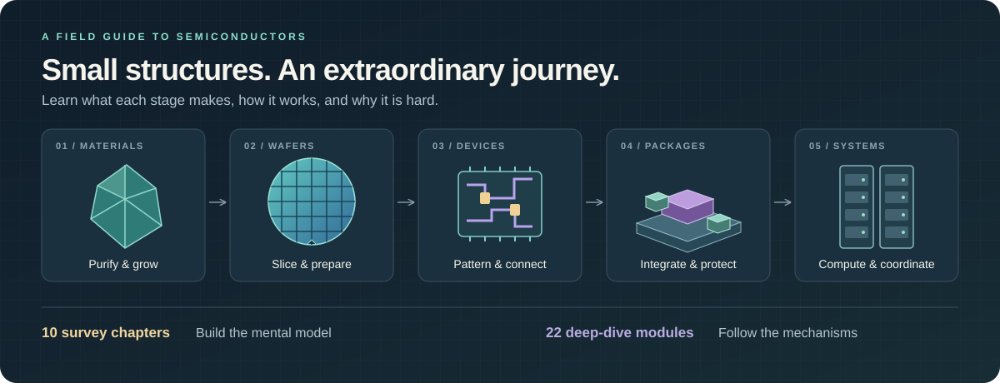

# Sand to GPU

**Understand how a chip becomes a computer.**

A visual, interactive course through the semiconductor supply chain: from quartz and silicon crystals to transistors, memory, advanced packaging, and GPU systems. Written for curious people with some programming experience and school-level science. No chip background required.



[Get started](#run-locally) · [Contribute](CONTRIBUTING.md) · [Development history](docs/DEVELOPMENT_HISTORY.md) · [Licensing](docs/LICENSING.md)

## Choose your depth

| Track | What you get | Where to start |
| --- | --- | --- |
| **Survey** | Ten chapters connecting the whole manufacturing journey. Build intuition, learn the vocabulary, then follow links into the detailed explanations. | Choose **Survey** in the reader. |
| **Deep dive** | Twenty-two modules covering mechanisms, equipment, calculations, failure modes, suppliers, and engineering tradeoffs. | Start with the overview, or use the chapter outline and glossary. |

The course includes **352 authored figures** and **46 interactive widget implementations**. Change a process parameter, inspect a physical structure, or work through a manufacturing tradeoff alongside the explanation. Quizzes, search, light and dark themes, and browser-local reading progress support self-study.

**Listen alongside the text.** Optional local Kokoro narration provides saved passages, word highlighting, playback speed controls, and paragraph seeking. With listening open, click a narrated paragraph to start there. A separately generated static edition can serve recordings without running a model for visitors.

**Bring your own AI assistant.** Use **Copy page for AI** or **Download Markdown** to take a complete chapter into the assistant of your choice. The reader does not embed an AI service or automatically send the chapter elsewhere.

## Run locally

Install **Node.js 22.12 or later** (Node.js 24 recommended) and npm, then:

```bash
git clone https://github.com/DicksonWu654/sand-to-gpu.git
cd sand-to-gpu
npm ci
npm run build
npm start
```

Open **[127.0.0.1:8790](http://127.0.0.1:8790)**. The server binds to your computer's loopback address by default. Stop it with `Ctrl+C`. Set `PORT` to use another port.

Reading, figures, labs, quizzes, and Markdown export work without a Python runtime or a speech model. Narration is optional. The page requests its fonts from Google Fonts; system fallbacks remain available if that request fails. Reading progress and preferences are stored in the browser, with no account or cross-device sync.

## Narration and publishing

| Edition | How audio works | What is required |
| --- | --- | --- |
| **Local reader** | Generates uncached passages on your computer, then reuses them. | Optional local Kokoro model and Python runtime. |
| **Static reader with audio** | Fetches saved MP3 files and word timings as needed. Visitors run no speech model. | A completed narration export uploaded with the website. |

A Git clone contains the course and application source, **not the recordings, model weights, or Python environment**. The September 2026 recorded edition comprises about 57 hours and 1.64 GB of MP3 audio. Those recordings are separate release artifacts; their existence in a local release does not make them downloadable from this repository.

For local speech, install `uv` and run `npm run narration:setup` before starting the server. The setup downloads the pinned model and runtime dependencies; synthesis then happens locally. The current implementation has been exercised on Linux. See the [narration notes](NARRATION_2026-09-13.md) for cache settings, voice choices, and timing limitations, and the [release guide](docs/PUBLISHING.md) for publishing instructions.

Audio covers the prose selected by the reader, not every table, diagram, equation, or reference. Word timings come from the speech model and pronunciation can be imperfect. Keep the written lesson nearby when studying technical notation.

## Explore the curriculum

| Stage | Topics |
| --- | --- |
| **Materials → wafers** | Polysilicon purification, crystal growth, wafer preparation, compound semiconductors, and consumables. |
| **Inside the fab** | Cleanrooms, deposition, oxidation, DUV and EUV lithography, etching, and doping. |
| **Devices → working dies** | Transistor architectures, interconnects, metrology, inspection, yield, and wafer testing. |
| **Memory → packages** | DRAM, NAND, HBM, package substrates, chiplets, and advanced integration. |
| **Systems → industry** | Final testing, GPU systems, economics, global suppliers, and policy. |

The [teaching guide](course/TEACHING_GUIDE.md) explains the course's approach: introduce the problem, build a mental picture, explain the mechanism, then give the quantities and tradeoffs. The [survey guide](course/SURVEY_GUIDE.md) describes the shorter route.

## Work on the course

The application uses plain JavaScript, CSS, and SVG. Markdown and structured figure data are compiled into the static reader; there is no application database.

```text
course/modules/       Deep-dive Markdown sources
course/survey/        Survey Markdown sources
course/quizzes/       Module quiz data
course/visuals/       Figure definitions, renderer, and coverage inventory
course/review/        Claim-review evidence and unresolved findings
course/v1/            Preserved first edition
site/                 Reader, widgets, styles, and generated content
qa/                   Static checks, browser scenarios, and review reports
tools/narration/      Local speech setup, generation, and export tools
docs/                 Contributor-facing guides and development history
build.js              Compiles course and full-page Markdown exports
serve.js              Local server and optional narration backend
```

After editing source content:

```bash
npm run build
npm run check
```

With the course server running, check an affected page or widget:

```bash
npm run qa:page -- "#/s/01" --width 375 --theme light
npm run qa:widget -- hbm-stack
```

`npm run check` and browser checks need Chrome or Chromium. Keep a full Git clone: the source-preservation check compares against a recorded historical baseline. The harness can use Puppeteer's browser or `PUPPETEER_EXECUTABLE_PATH`; use `npx puppeteer browsers install chrome` if a browser is missing. Set `QA_BASE_URL` when testing another port. Read [CONTRIBUTING.md](CONTRIBUTING.md) for content, visual, and validation standards before opening a pull request.

## License

The website code and tools are open source under the [MIT License](LICENSE). Original lessons, quizzes, educational illustrations, and project-produced narration are available under [CC BY 4.0](LICENSE-CONTENT), to the extent the contributors hold rights. See [license scope and attribution](docs/LICENSING.md) and [third-party notices](THIRD_PARTY_NOTICES.md); upstream dependencies, models, fonts, and separately attributed material retain their own terms.

## Accuracy and provenance

This is an **AI-assisted educational project**, developed through repeated human feedback, source checks, visual audits, and corrections. Its [development history](docs/DEVELOPMENT_HISTORY.md) preserves what changed and why, including approaches that did not work well. AI-assisted review is not independent expert certification.

The course distinguishes documented technical facts, approximate operating ranges, and illustrative calculations. Supplier examples should reflect the global industry and the same evidence standard across regions. Policy is described from the relevant jurisdiction's perspective. Markets, product roadmaps, and process capabilities change; dated claims are not live data.

The [second-round review summary](course/review/ROUND2_SUMMARY_2026-09-13.md) records 669 assessed claims, including 193 explicitly unresolved rows. That is a targeted review, not exhaustive verification of the entire course. Consult the relevant module's sources and review ledger before relying on a number. Passing browser checks establishes software behavior, not scientific correctness.

Corrections, clearer explanations, better diagrams, and accessibility improvements are welcome. See [contributing](CONTRIBUTING.md), [security reporting](SECURITY.md), and [licensing](docs/LICENSING.md).
